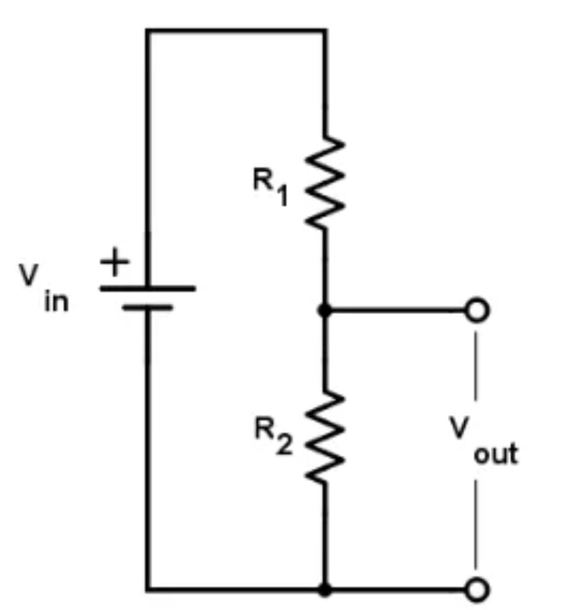
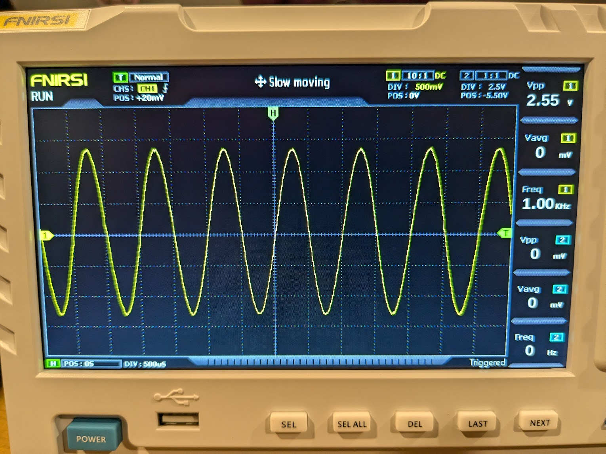

# Part 1 - Resistors, capacitors, and recording fundamentals 

## Voltage divider

A voltage divider is an electrical circuit that outputs a fraction of
the input voltage it receives. Consider the circuit below.

{: style="width: 2.418474409448819in; height: 2.563583770778653in;" }

The current going through $R_{1}$, also passes through $R_{2}$. We'll
call this current $I$. According to Ohm's law:

$$V_{in\ } = I\ {(R}_{1}\  + \ R_{2})$$

$$V_{out}\  = \ I\ R_{2}$$

Therefore:

$$V_{out}\  = \ \frac{R_{2}}{(R_{1} + R_{2})}V_{in}$$

The ratio between the $V_{out}$ and $V_{in}$ depends on the values of
the resistors $R_{1}$and $R_{2}$. Note that this ratio is always less
than one. Voltage dividers are passive circuits, they don't have their
own power source, and as such, can only attenuate the voltage. In order
to amplify voltages, we need active parts, as we will see in the
following sections.

**Exercise 1-1** - Build a voltage divider as shown in the above
circuit, where $V_{in}$ is the voltage between the positive supply
voltage and the ground (15v). Use $R_{1}\  = \ R_{2}\  \approx \ 1\ kOhm$, and
measure $V_{out}$ using your multimeter.

- What is $V_{out}$?

- Change $R_{2}$ to a resistor with a lower value, e.g. $300\ Ohm$. What is $V_{out\ }$now?

## Using the oscilloscope to measure signals

Next, we need to get comfortable with our oscilloscope because we are going to be using it a lot over the next couple days.

{: style="width: 6.4375in; height: 2.9166666666666665in;" }

Our scopes have 2 input channels. Either of the inputs can be sent through a threshold to capture the signals collected on both channels in the vicinity of a trigger event.

**Exercise 1-2** - Let's use the oscilloscope to measure the voltage divider output. Connect an oscilloscope probe to **Channel 1** (orange port). Connect the probe tip to $V_{out}$ of your voltage divider (with $R_1 = R_2 \approx 1\text{ kOhm}$), and the probe ground clamp to your circuit ground.

Hit **CONF** on channel one and use the arrow and OK buttons to select the following options:

- Probe: 10x (make sure that the 10x switch is set on the probe itself)

- Coupling: DC

- FFT: Off

Adjust your channel one's vertical settings to the following using its knobs:

- DIV: 2 V (this means 2 V per vertical graticule)

- POS: 0V (this is the vertical offset voltage applied to the measured signal)

Adjust the horizontal settings to:

- POS: 0 (you can press the ORIG button to get this setting)

- DIV: 500 μs (this means 500 μsec per horizontal graticule)

What is the voltage level shown on the screen? Does it match your multimeter measurement from Exercise 1-1?

## Floating Inputs

Before building more complex circuits, it is important to understand what happens to an electrical node that is not connected to a defined voltage—a state known as a **floating** input.

**Exercise 1-3**

Connect an oscilloscope probe to **Channel 1** of your oscilloscope. Leave the other end of the wire completely disconnected (floating in the air). Set the oscilloscope scale to a sensitive vertical range (e.g., $50\,\text{mV/div}$ or $100\,\text{mV/div}$).

- What do you see? Why? What happens if you shake the wire around?

Connect the ground of the oscilloscope (the tiny crocodile clamp) to the signal input on the same channel.

- What happens to the noise? Why? What happens when you move the probe?

## Pull-down resistor

Now we want to build a simple circuit to measure the state of a button. We will build this 
circuit in two steps to see how a floating node behaves in a real circuit:

**Exercise 1-4**

1. Place a push button on your breadboard.
2. Connect one side to the $+5\,\text{V}$ supply.
3. Connect the opposite side to your oscilloscope probe to measure $V_{\text{out}}$. Leave it completely disconnected from any resistor or ground.
4. Set the scope to a sensitive vertical range (e.g., $100\,\text{mV/div}$ or $500\,\text{mV/div}$).

<figure align="center" markdown="1">
  
  <figcaption markdown="1"><b>Floating switch circuit.</b> The output terminal $V_{\text{out}}$ is completely disconnected from any resistor or return path when the switch is open, making the input float.</figcaption>
</figure>

* **Question:** What is $V_{\text{out}}$ when you press the button? What happens to the voltage when you release the button? Does it quickly and cleanly return to $0\,\text{V}$?

5. Now, connect a $10\,\text{k}\Omega$ resistor between your signal line ($V_{\text{out}}$) and the negative terminal of the battery (the bottom return line) as shown in the schematic below.

<figure align="center" markdown="1">
  
  <figcaption markdown="1"><b>Switch circuit with a pull-down resistor.</b> When the switch is open, the resistor pulls $V_{\text{out}}$ down to the negative terminal of the battery (0V). When the switch is closed, it connects the positive terminal (+5V) directly to $V_{\text{out}}$.</figcaption>
</figure>

* **Question:** What is the voltage at $V_{\text{out}}$ when the button is released now? 
* **Question:** What is the voltage when the button is pressed?
* **Question:** Measure and calculate the expected voltage at $V_{\text{out}}$ when the switch is closed. Use the voltage divider formula from Exercise 1-1 (treating the closed switch as a resistor $R_{\text{switch}} \approx 1\,\Omega$). 

This experiment demonstrates why inputs (such as amplifier channels or microcontroller pins) must never be left floating. When no active source is driving a wire, we need a way to tie it to a default reference. We achieve this using a **pull-down resistor** (a resistor connecting the signal line to the negative terminal) or a **pull-up resistor** (connecting it to the positive terminal), which keeps the node at a stable state while allowing active signals to easily override it.

---

## Generating signals with the oscilloscope

Now we want to use the function generator built into our oscilloscope to generate periodic signals.

**Exercise 1-5**

Connect a BNC cable between channel 1 (orange port) and the voltage generator (green port). Hit **CONF** on channel one and use the arrow and OK buttons to select the following options:

- Probe: 1x (BNC cable)

- Coupling: DC

- FFT: Off

Next, we will generate a sinusoidal wave to simulate some interesting signal from the brain. Press the **GEN** button on the scope to pull up the function generator menu. You can then change the settings to output periodic voltage waveforms of different types, frequencies and duty cycles using the arrow and OK keys at the top of the scope:

- Set the type to Sine

- Set the frequency to 1 kHz

To ensure the signal is actually being produced, connect a BNC cable between the output on the scope and one of the inputs on the scope. Adjust your channel one's vertical settings to the following using its knobs:

- DIV: 500 mV (this means 500 mV per vertical graticule)

- POS: 0V (this is the vertical offset voltage applied to the measured signal)

Adjust the horizontal settings to:

- POS: 0 (you can press the ORIG button to get this setting)

- DIV: 500 μs (this means 500 μsec per horizontal graticule)

Finally, we need to adjust our trigger to capture this waveform:

- Mode: normal (only trigger when a threshold crossing occurs)

- Edge: rising

- Position: 0V

Make sure your scope is running by pressing the Run/Stop button. If all has gone well you should see something like this on your screen:

{: style="width: 4.921875546806649in; height: 3.69538823272091in; display: block; margin: 0 auto;" }

## Electrode Model

**Exercise 1-6** - What happens if you put an electrode in the brain and measure the output? In this exercise, we will build a simple circuit to mimic this scenario. First we need to plug in our 10x probes to get accurate measurements. Plug one into each input channel of the scope and then configure them using the CONF button:

- Probe: 10x (make sure that the 10x switch is set on the probe itself)

- Coupling: DC

- FFT: Off

Now that we can make measurements and generate signals with our scope, we want to measure the output from a simple electrode model. We consider the following circuit as a simplified model of the electrode and the measurement system.

{: style="width: 2.6770833333333335in; height: 1.823520341207349in;" }

We imagine that the function generator on the scope (voltage source in the image above) is a huge neuron. $R_{s}$ stands for the series resistance of the electrode. $R_{sh}$ is the shunt or parallel resistor and represents the effective resistance along all possible paths through which the current can flow to the ground through your recording system.

First, add $R_{s} = 10\text{ kOhm}$ to the breadboard. Before completing the circuit, use two oscilloscope probes along with the second channel on the oscilloscope to measure the input voltage and $V_{out}$ after 'electrode series resistance' $R_{s}$. How do the two voltage measurements compare?

Next, complete your electrode model by adding $R_{sh} = 220\text{ Ohm}$ to the circuit. Using two oscilloscope probes, measure the voltage before and after the 'electrode' ($V_{out}$ and the function generator output). How much is the signal attenuated when measured?

This attenuation is to a large degree unavoidable. We'll see later how this can be overcome.
