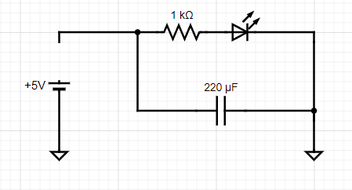
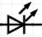
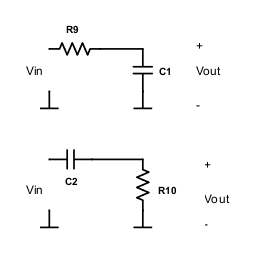

# Part 2 - Passive filters

!!! warning "Data Persistence"
    The interactive tables below store data in your browser's temporary memory. **Refreshing the page or closing the tab will clear your entries.** Please use the "Export CSV" or "Save Plot" buttons to save your work.

## Capacitor charge and discharge

**Exercise 2-1** - Next, we want to understand how capacitors store charge and resist changes in voltage. On your breadboard, build the following circuit.

{: style="width: 3.869792213473316in; height: 2.1800404636920385in;" }

Measure the voltage across the capacitor using the oscilloscope. What is it?

With your probes attached to the circuit, disconnect the lead from +5V to the circuit.

{: style="width: 4.46875in; height: 2.408546587926509in;" }

{: style="width: 0.3697922134733158in; height: 0.3254166666666667in;" }

- LED

- What happens to the LED?

- What happens to the voltage on the scope? Why? (Hint: there is a first and second-order answer to this question, a full explanation requires considering the LEDs I/V characteristics which you can look into if you want :)

**Capacitors and filters:**

The simplest form of filtering in electronics is by using a resistor and
a capacitor. To get an intuition of how this can be achieved, you can
think of capacitors as elements whose "resistance" changes depending on
the frequency of the input. DC current can not pass through capacitors
(frequency=0), so it has an infinite resistance against DC current. AC
current, however, passes through the capacitor. The higher the
frequency, the lower the "resistance" of the capacitor. More precisely
the current through a capacitor is proportional to the rate of voltage
changes ($I\  = \ C\ dV/dt$). Consider the 2 circuits below.

{: style="width: 2.8125in; height: 2.7340113735783027in;" }

**Question:** Which one do you think is a high pass filter (allows
higher frequencies to pass to the output) and which one is a low pass
filter? (consider 2 extreme cases of very high and zero input
frequencies)

Notice how easily combining resistors and capacitors in parallel or
series makes a filter and modifies the frequency bandwidth of your
circuit. This filtering is not always desirable. In practice, you
sometimes filter signals unintentionally due to the resistive and
capacitive properties of your recording system. For instance,
voltage-clamp recordings are limited by the resistance and capacitance
of your electrode. Although it is not always possible to avoid this
problem, you should at least watch out for it.

**Exercise 2-2:** Assemble a **highpass** filter with the following
values and use it to filter the function generator.

$$R_{1} = 1\text{ k}\Omega$$

$$C_{1} = 0.47\,\mu\text{F}$$

Note: If you have an electrolytic capacitor, the negative pin is the shorter one.

The frequency cutoff (defined as $\sim 30\%$ reduction in voltage amplitude)
of the filter is $\frac{1}{2\pi R_{1}C_{1}}$.

To test the frequency response of this circuit connect your function
generator to drive Vin and measure both this input signal and the output
of the circuit using your scope inputs. From the "Gen" menu on the
scope, adjust the output frequency of a sine wave, note the
corresponding amplitudes of the input and output of your circuit, and
fill out the following table:

  <table id="table-highpass" style="width: 100%; border-collapse: collapse;">
    <thead>
      <tr style="background: #3f51b5; color: white;">
        <th style="padding: 10px; border: 1px solid #ddd;">Frequency</th>
        <th style="padding: 10px; border: 1px solid #ddd;">Vin (V)</th>
        <th style="padding: 10px; border: 1px solid #ddd;">Vout (V)</th>
      </tr>
    </thead>
    <tbody>
      <tr><td style="padding: 10px; border: 1px solid #ddd;">1 Hz</td><td contenteditable="true" style="padding: 10px; border: 1px solid #ddd; background: white;"></td><td contenteditable="true" style="padding: 10px; border: 1px solid #ddd; background: white;"></td></tr>
      <tr><td style="padding: 10px; border: 1px solid #ddd;">5 Hz</td><td contenteditable="true" style="padding: 10px; border: 1px solid #ddd; background: white;"></td><td contenteditable="true" style="padding: 10px; border: 1px solid #ddd; background: white;"></td></tr>
      <tr><td style="padding: 10px; border: 1px solid #ddd;">10 Hz</td><td contenteditable="true" style="padding: 10px; border: 1px solid #ddd; background: white;"></td><td contenteditable="true" style="padding: 10px; border: 1px solid #ddd; background: white;"></td></tr>
      <tr><td style="padding: 10px; border: 1px solid #ddd;">50 Hz</td><td contenteditable="true" style="padding: 10px; border: 1px solid #ddd; background: white;"></td><td contenteditable="true" style="padding: 10px; border: 1px solid #ddd; background: white;"></td></tr>
      <tr><td style="padding: 10px; border: 1px solid #ddd;">100 Hz</td><td contenteditable="true" style="padding: 10px; border: 1px solid #ddd; background: white;"></td><td contenteditable="true" style="padding: 10px; border: 1px solid #ddd; background: white;"></td></tr>
      <tr><td style="padding: 10px; border: 1px solid #ddd;">500 Hz</td><td contenteditable="true" style="padding: 10px; border: 1px solid #ddd; background: white;"></td><td contenteditable="true" style="padding: 10px; border: 1px solid #ddd; background: white;"></td></tr>
      <tr><td style="padding: 10px; border: 1px solid #ddd;">1 kHz</td><td contenteditable="true" style="padding: 10px; border: 1px solid #ddd; background: white;"></td><td contenteditable="true" style="padding: 10px; border: 1px solid #ddd; background: white;"></td></tr>
      <tr><td style="padding: 10px; border: 1px solid #ddd;">5 kHz</td><td contenteditable="true" style="padding: 10px; border: 1px solid #ddd; background: white;"></td><td contenteditable="true" style="padding: 10px; border: 1px solid #ddd; background: white;"></td></tr>
      <tr><td style="padding: 10px; border: 1px solid #ddd;">10 kHz</td><td contenteditable="true" style="padding: 10px; border: 1px solid #ddd; background: white;"></td><td contenteditable="true" style="padding: 10px; border: 1px solid #ddd; background: white;"></td></tr>
      <tr><td style="padding: 10px; border: 1px solid #ddd;">50 kHz</td><td contenteditable="true" style="padding: 10px; border: 1px solid #ddd; background: white;"></td><td contenteditable="true" style="padding: 10px; border: 1px solid #ddd; background: white;"></td></tr>
      <tr><td style="padding: 10px; border: 1px solid #ddd;">100 kHz</td><td contenteditable="true" style="padding: 10px; border: 1px solid #ddd; background: white;"></td><td contenteditable="true" style="padding: 10px; border: 1px solid #ddd; background: white;"></td></tr>
    </tbody>
  </table>
  

    <canvas id="plot-highpass"></canvas>
  

  

    <button onclick="exportCSV_table-highpass()" style="padding: 8px 16px; background: #4caf50; color: white; border: none; border-radius: 4px; cursor: pointer;">Export CSV</button>
    <button onclick="downloadPlot_table-highpass()" style="padding: 8px 16px; background: #2196f3; color: white; border: none; border-radius: 4px; cursor: pointer;">Save Plot Image</button>
  

- What happens to the amplitude of the output as the input frequency
  varies?

**Exercise 2-3:** Feed a 400 Hz sinusoidal signal to your circuit, and
visualize the input and output of the high pass filter with 2
oscilloscope probes. Do you notice any difference between input and
output signals other than the amplitude?

Filters, in addition to modulating the amplitude of signals, produce a
lag, causing the phase of the output signal to be shifted from the
input.

Change the input frequency to 1000 Hz, does the phase lag change?

**Exercise 2-4:** So far we have been recording sine waves. Square waves
consist of a broad range of frequencies, with edges containing high
frequencies. Produce a square wave with your scope's function generator
and then use the scope to measure the signal before and after the
filter.

- What do you observe?

- Turn on the FFT function on each of your scopes' inputs (CONF button).
  What do you see? (Hint: if you don't see anything interesting, try
  changing the bandwidth of your measurement using the horizontal
  controls on your scope.)

You should be aware that, when your input signal contains a broad range
of frequencies, filtering can affect each frequency component
differently. The most obvious change is that each frequency's amplitude
is changed (this is generally the purpose of filtering, after all).
However, the relative phases of the signal can also change. This will
manifest as distortions in the time domain (peaking and oscillations).
There are many different types of filters that are designed to minimize
the impact on certain aspects of the signal, but they always come with
tradeoffs. Be careful when interpreting filtered signals, you need to
understand exactly what effect they have across frequencies before
comparing raw and filtered signals, or the results of different filter
types. The phase response of a filter captures its effect on the phase
of various frequency components. For the first order RC filter you have
$\text{phase shift}(f) = -\arctan(2\pi fRC)$

**Exercise 2-5:** Assemble a **low pas**s filter with the following
values:

$$R_{2} = 220\text{ k}\Omega, C_{2} = 560\text{ pF}$$

The frequency cutoff of the filter is $\frac{1}{2\pi R_{1}C_{1}}$

Again, try changing the frequency of the input sine wave to test the
filter to fill out the following table:

  <table id="table-lowpass" style="width: 100%; border-collapse: collapse;">
    <thead>
      <tr style="background: #3f51b5; color: white;">
        <th style="padding: 10px; border: 1px solid #ddd;">Frequency</th>
        <th style="padding: 10px; border: 1px solid #ddd;">Vin (V)</th>
        <th style="padding: 10px; border: 1px solid #ddd;">Vout (V)</th>
      </tr>
    </thead>
    <tbody>
      <tr><td style="padding: 10px; border: 1px solid #ddd;">1 Hz</td><td contenteditable="true" style="padding: 10px; border: 1px solid #ddd; background: white;"></td><td contenteditable="true" style="padding: 10px; border: 1px solid #ddd; background: white;"></td></tr>
      <tr><td style="padding: 10px; border: 1px solid #ddd;">5 Hz</td><td contenteditable="true" style="padding: 10px; border: 1px solid #ddd; background: white;"></td><td contenteditable="true" style="padding: 10px; border: 1px solid #ddd; background: white;"></td></tr>
      <tr><td style="padding: 10px; border: 1px solid #ddd;">10 Hz</td><td contenteditable="true" style="padding: 10px; border: 1px solid #ddd; background: white;"></td><td contenteditable="true" style="padding: 10px; border: 1px solid #ddd; background: white;"></td></tr>
      <tr><td style="padding: 10px; border: 1px solid #ddd;">50 Hz</td><td contenteditable="true" style="padding: 10px; border: 1px solid #ddd; background: white;"></td><td contenteditable="true" style="padding: 10px; border: 1px solid #ddd; background: white;"></td></tr>
      <tr><td style="padding: 10px; border: 1px solid #ddd;">100 Hz</td><td contenteditable="true" style="padding: 10px; border: 1px solid #ddd; background: white;"></td><td contenteditable="true" style="padding: 10px; border: 1px solid #ddd; background: white;"></td></tr>
      <tr><td style="padding: 10px; border: 1px solid #ddd;">500 Hz</td><td contenteditable="true" style="padding: 10px; border: 1px solid #ddd; background: white;"></td><td contenteditable="true" style="padding: 10px; border: 1px solid #ddd; background: white;"></td></tr>
      <tr><td style="padding: 10px; border: 1px solid #ddd;">1 kHz</td><td contenteditable="true" style="padding: 10px; border: 1px solid #ddd; background: white;"></td><td contenteditable="true" style="padding: 10px; border: 1px solid #ddd; background: white;"></td></tr>
      <tr><td style="padding: 10px; border: 1px solid #ddd;">5 kHz</td><td contenteditable="true" style="padding: 10px; border: 1px solid #ddd; background: white;"></td><td contenteditable="true" style="padding: 10px; border: 1px solid #ddd; background: white;"></td></tr>
      <tr><td style="padding: 10px; border: 1px solid #ddd;">10 kHz</td><td contenteditable="true" style="padding: 10px; border: 1px solid #ddd; background: white;"></td><td contenteditable="true" style="padding: 10px; border: 1px solid #ddd; background: white;"></td></tr>
      <tr><td style="padding: 10px; border: 1px solid #ddd;">50 kHz</td><td contenteditable="true" style="padding: 10px; border: 1px solid #ddd; background: white;"></td><td contenteditable="true" style="padding: 10px; border: 1px solid #ddd; background: white;"></td></tr>
      <tr><td style="padding: 10px; border: 1px solid #ddd;">100 kHz</td><td contenteditable="true" style="padding: 10px; border: 1px solid #ddd; background: white;"></td><td contenteditable="true" style="padding: 10px; border: 1px solid #ddd; background: white;"></td></tr>
    </tbody>
  </table>
  

    <canvas id="plot-lowpass"></canvas>
  

  

    <button onclick="exportCSV_table-lowpass()" style="padding: 8px 16px; background: #4caf50; color: white; border: none; border-radius: 4px; cursor: pointer;">Export CSV</button>
    <button onclick="downloadPlot_table-lowpass()" style="padding: 8px 16px; background: #2196f3; color: white; border: none; border-radius: 4px; cursor: pointer;">Save Plot Image</button>
  

What happens to the amplitude and phase of the output as the input
frequency varies?

## Generate a frequency sweep with a PicoScope

Our oscilloscope does not have the option to generate frequency sweeps
(or "chirps"), to do this we can use a digital oscilloscope - the
PicoScope[^4].

- Install Pico scope software:

- <u>[https://www.picotech.com/downloads</u>](https://www.picotech.com/downloads)

- Install Picoscope 7 T&M

Connect the USB cable, start the software, and check that the software
detects the hardware ("Picoscope 2204A). Select it and click on the
"Gen" section on the top left and sweep, On, Up Down, and reasonable
frequency.

{: style="width: 2.8586318897637795in; height: 4.828125546806649in;" }

**Exercise 2-6:** Connect the output of the PicoScope "AWG" to your
oscilloscope and look at the raw signal as well as at the Fourier
transform (FFT). What is the FFT doing? Connect the input to your filter
circuit and look at the output. Does it all make sense?

[^4]: PicoScope could also be used for recording data, instead of the oscilloscope ... but they can be very fiddly (i.e. crash, bug, require to be restarted for things to work again) ... so do it at your own risk and keep the simpler oscilloscope at hand if you do.
