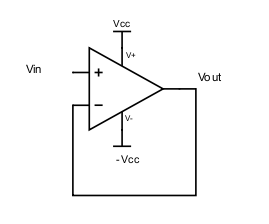
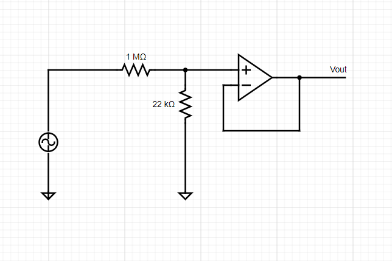
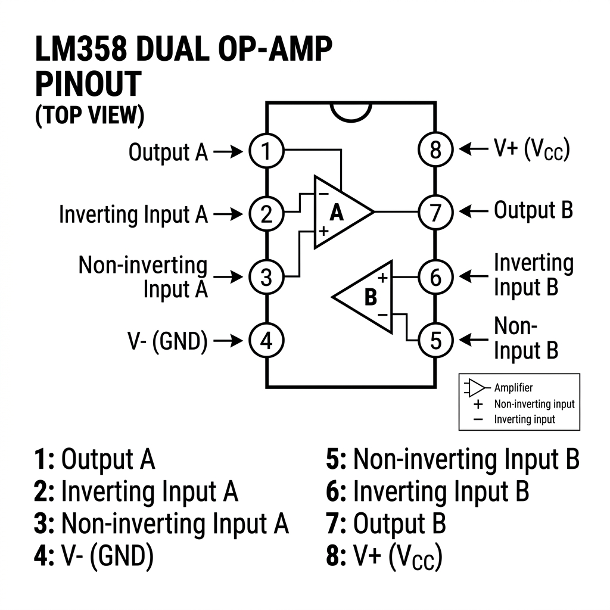
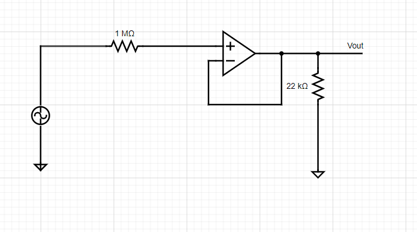
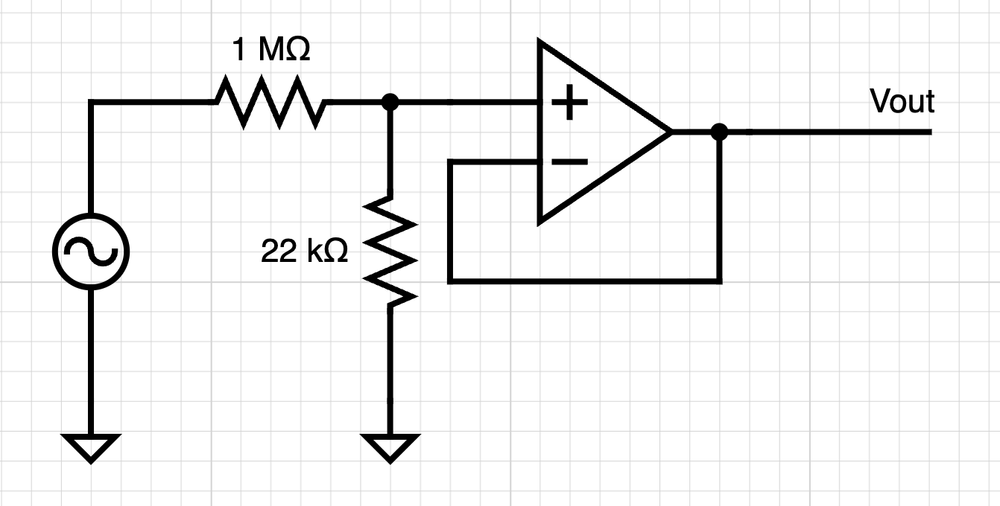
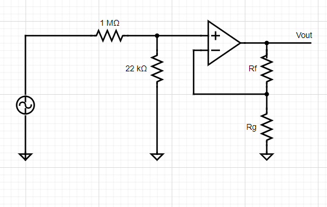

# Part 3 - Voltage followers and input impedance

A common way to produce a large input impedance in electronics is using
the following circuit:

{: style="width: 1.8697922134733158in; height: 1.557001312335958in; display: block; margin: 0 auto;" }

This circuit is called a voltage follower or voltage buffer. It is an
op-amp with its output connected to its negative input. In this circuit,
$V_{out\ } = V_{in}$. As the input pins of the opamp do not draw
current, you have a way of monitoring the input voltage without
affecting it. In practice, however, when you have very fast changes of
$V_{in}$, $V_{out}$ might not be able to follow immediately (because of
the capacitances in the circuit). This characteristic of an opamp is its
bandwidth. An op amp's bandwidth is the widest (it is capable of
following the fastest signals) when its gain is lowest (when it is used
as a follower).

**Exercise 3-1** - Build a voltage divider, connected to your sine wave
source with $R_{s}\  = \ 1\ MOhm$ and $R_{sh}\  = \ 22\ kOhm$ (see
circuit below).

{: style="width: 3.5833333333333335in; height: 2.875in; display: block; margin: 0 auto;" }

- What happens to Vout when you disconnect $R_{sh}$?

Now add a voltage buffer between $R_{s}$ and $R_{sh}$ (see circuit
below). Use $Rf\  = \ 1\ kOhm$for the feedback resistor. To do this,
you will need to use an op-amp. We will use LM358AN/LM358AP (you can
google the datasheet). It's not the best op-amp, it's not the worst.
But it's certainly one of the cheapest. It's also really forgiving \--
it allows large voltage rails and is stable with poorly regulated power
supplies.

- If you were using a more finicky op-amp that required really stable
  voltage rails, how might you do that? (Hint: which passive circuit
  element acts like a little battery that resists changes in voltage?)

To generate the positive and negative power supply voltage for the
op-amp, you will use two variable DC power supplies to power your op-amp
(or one dual supply). 

**<u>Make sure you look at the op-amp datasheet for
the proper range of dc supply voltage and polarity</u>**. <small>(It's
max = 32 V)</small>.

The following diagram is an overhead view of the LM358 with its pins
labeled. Use this as a map when making connections on your breadboard.

{: style="width: 4in; height: 4in; display: block; margin: 0 auto;" }

Now, go forth and place a voltage follower between the $1\ MOhm$
resistor and the $22\ kOhm$ resistor on the breadboard:

{: style="width: 5.265587270341207in; height: 2.9310061242344707in; display: block; margin: 0 auto;" }

- Now, what happens to Vout when you disconnect $R_{sh}$? And when you
  put a low resistance (\~$1\ kOhm$) instead?

- Is this circuit amplifying the signal?

<!-- -->

- **Bonus:** The op-amp's inputs have very high input impedance. In the
  above circuit, calculate the peak current flowing through the
  $22\ kOhm$ resistor. Where is this current coming from? What voltage
  would be required to generate this current without the op-amp? Would
  this be possible using passive elements?

## **Exercise 3-2** 

Move the $22\ kOhm$ resistor to the input side of the op-amp. 

{: style="width: 4.526919291338583in; height: 2.2927602799650044in; display: block; margin: 0 auto;" }

- What is the attenuation imposed by the resistor divider?

Remember that the gain of a non-inverting feedback network is given by $k\  = 1 + \ \frac{R_{f}}{R_{g}}$ . Get a couple of resistors with values between $1\ kOhm$ and $100\ kOhm$ that allow you to approximately (within 10%) undo the attenuation that is imposed on the input signal by the $\frac{1\ MOhm}{22\ kOhm}$ resistor divider to recover your input waveform.

{: style="width: 5.822916666666667in; height: 3.6875in; display: block; margin: 0 auto;" }

- What values did you choose for $R_{f}$ and $R_{g}$? What is the
  calculated gain?

<!-- -->

- Bonus: Why is trying to **exactly** undo the attenuation a fool's errand
  (Hint: think about if your resistors are _exactly_ what they claim
  to be)

##  

