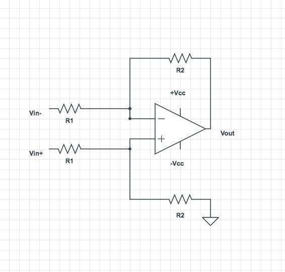
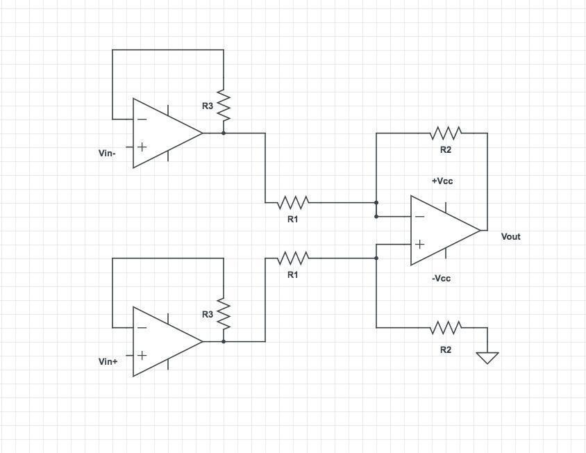
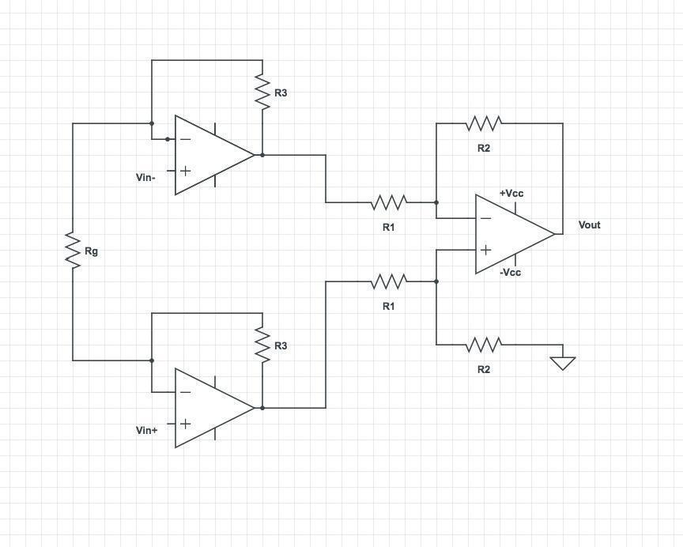
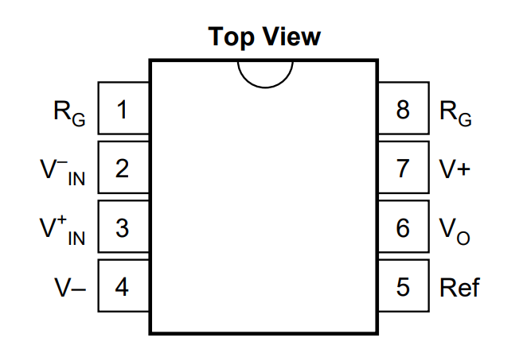

# Part 5 - Differential amplification 

## Differential amplifier

As seen in the previous section, when using an electrode to measure
extracellular signals, the voltages are significantly attenuated. We can
use an active circuit to amplify these signals. Moreover, when recording
extracellular signals, we would like to perform a differential
measurement, that is to measure the voltage difference between an
electrode and a reference (different from the ground in the general
case). This type of measurement differs from the single-ended
measurements we have seen so far, in which one of the voltages is the
ground.

A differential amplifier amplifies the voltage difference between two
points and gets rid of the signal common to both (which could be noise,
artifact, or any biological signal common to both electrodes that we are
not interested in). A differential amplifier can be built out of an
op-amp with a feedback resistor between one input and one output port,
as shown below:

{: style="width: 2.6979166666666665in; height: 1.9027777777777777in; display: block; margin: 0 auto;" }

An ideal differential amplifier will amplify the difference between its
2 input ports:

$$V_{out\ } = \ A_{d\ }(V_{in\  + \ } - \ V_{in\  -})$$

$$\ A_{d\ \ \ } = \ \frac{R_{2}}{\ R_{1}}$$

$A_{d}$ is referred to as the differential gain.

**Question (bonus):** Can you derive the gain term? Hint: $R_{1}$ and
$R_{2}$ effectively acts as a voltage divider.

## Common mode noise rejection:

**Question:** If differential amplifiers get rid of the common signal,
they should get rid of all noise. Then why do we need to use Faraday
cages to remove line noise?

**Answer:** First, the exact amount of noise in V~in+~ might be
different from that in V~in-~ (why could this be the case?). Second, the
noise could reach the system after the amplifier. Finally, in practice,
differential amplifiers are not perfect, and some of the common voltage
to $V_{in +}$and $V_{in\  -}$ also makes its way to the output.
Therefore the output voltage is:
$$V_{out\  +} = \ A_{d\ }(V_{in\  + \ } - \ V_{in\  -})\  + \ A_{cm}(V_{in\  + \ } + \ V_{in\  -})$$
Ideally, we want $A_{cm}$to be zero. In practice, it is never zero, but
a very small value (the datasheet will specify this value for your
op-amp model). The smaller $A_{cm}$, the better the differential
amplifier suppresses the common noise at its inputs, which is referred
to as having a higher common mode rejection ratio (CMRR).

When dealing with small signals (differential term) and very large noise
(common mode term), such as line noise, even a small $A_{cm}$ can lead
to a large common mode term in the output that not only overwhelms the
signal but more importantly, can saturate the amplifier. Saturation
leads to permanent information loss. Therefore it is crucial to
eliminate noise as much as possible.

## Instrumentation amplifier

Let's put everything we've learned so far together. If we add two
voltage followers at the inputs of the differential amplifier, we get
the following circuit (you don't need to make it):

{: style="width: 3.75in; height: 2.9009437882764653in; display: block; margin: 0 auto;" }

This is called an instrumentation amplifier and is a basic building
block of many e-phys measurement systems. It has a high input impedance
and amplifies the signal.

In practice, an additional resistor is added between the inverting
inputs of the two voltage followers. The final gain of the circuit will
be $\ (\frac{R_{2}}{R_{1}}) \times (1 + \frac{{2R}_{3}}{R_{g}}\ )$,
which can be easily modified by changing $R_{g}$.

{: style="width: 4.029514435695538in; height: 2.9175120297462818in; display: block; margin: 0 auto;" }

**Question (bonus):** Can you think of an advantage for adding $R_{g}$?

**Question (bonus):** If you wanted to design your own amplifier for an
extracellular recording system, what parameters would you consider when
choosing the amplification gain?

**Exercise 5-1:**

In this section, we will use a commercial instrumentation amplifier that
encapsulates this entire circuit in a single chip designed to amplify
small differential signals and remove their common modes (noise).

Next, get an INA121 instrumentation amplifier and mount it on your
breadboard. It may be a good idea to find the datasheet for this device,
which will tell you all about its operation.

Now, set the gain using $R_{g\ } = 47\ kOhm$.

- Measure the gain.

{: style="width: 4.057292213473316in; height: 2.803338801399825in; display: block; margin: 0 auto;" }

Change the value of $R_{g}$to get a gain of 10 or higher (check the
datasheet).

- What happens to your signal?

Switch $R_{g\ }$ back to $47\ kOhm$, and do not disassemble your
circuit. We'll come back to it.
