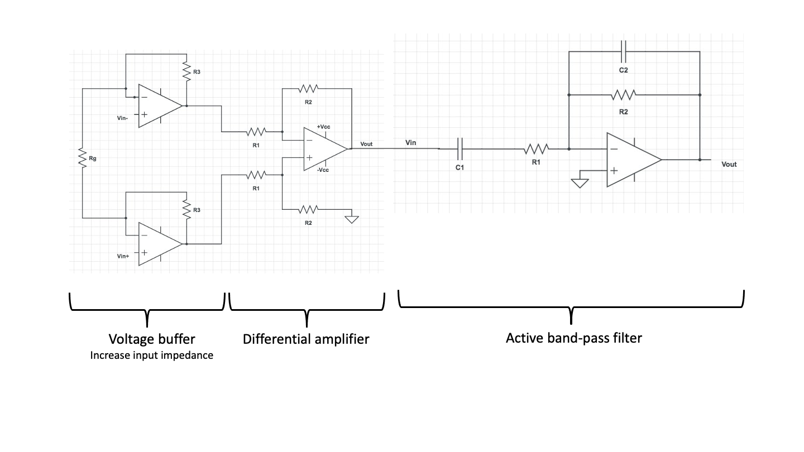

# Part 6 - the full circuit

You have so far built all the essential elements you need to measure
extracellular signals. You will get the full analog ephys measurement
system by adding the filter to the amplifier stage.

{: style="width: 100%; max-width: 900px; display: block; margin: 0 auto;" }

**Question (bonus):** Both the filter and the instrumentation amplifier
amplify the signal. What do you think is the advantage of this 2 stage
amplification compared to doing all the amplification at one stage?

**Exercise 6-1 (bonus)** - Use your full circuit to record spikes from a
cockroach leg.

For this portion of the lab, if you have been using wall wart power supplies, it may be a good idea to switch to a linear benchtop supply. The
TAs can come around with a supply and attach it to your amplifier when
you are ready to record since you don't have enough for each group.

- The benchtop supply will provide the same DC voltage values as a mobile phone charger would do. Why do you think it might nevertheless be a good
  idea to use them? Hint: they are heavy and expensive compared to the
  little supplies.

