# TENSS 2026 - Electronics Practical

##  Component reference:

### Resistor
A passive[^1] circuit element that resists the flow of
current. You can think of them like constrictions in a water pipe. They
are non-polarized (so it doesn't matter in which direction you put them)
and look like this:

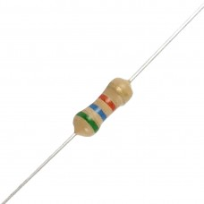{: style="width: 1.6822714348206473in; height: 1.6822714348206473in; display: block; margin: 0 auto" }

The color code indicates the resistance (the amount of constriction in
the pipe). However, it is often easier just to measure them using an
ohmmeter instead of memorizing the color code :).

### Capacitor
A passive[^2] circuit element that resists changes in
voltage and passes AC currents. You can think of them like diaphragms in
a water pipe. Some are non-polarized and others are. If you
reverse-polarize the latter, the [<u>magic blue smoke</u>](https://en.wikipedia.org/wiki/Magic_smoke) that's
inside them and allows them to work will escape! Don't let the magic
blue smoke out because it's very hard to put it back inside.

<figure align="center">
  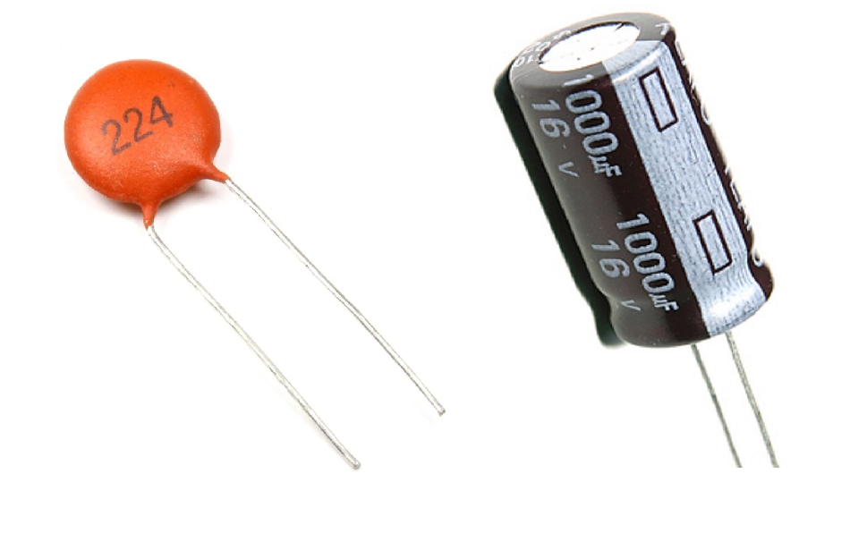
  <figcaption><b>Capacitors.</b> (left) A non-polarized 0.22 uF ceramic capacitor and (right) a polarized 1000 uF electrolytic capacitor with its negative lead clearly marked. The voltage rating indicates the max voltage the capacitor should be used with.</figcaption>
</figure>

### Switch (Push Button)
A simple mechanical device that can connect or disconnect an electrical path. The switches in your kit are **momentary tactile push buttons**, meaning they only make contact while you are actively pressing them down.

<figure align="center">
  
  <figcaption><b>Tactile Push Buttons.</b> (left) Underside view overlaid with internal schematic: the green line and blue line show the pairs of pins that are permanently connected together. The white switch symbol shows the bridge created when the button is pressed. (right) Top view.</figcaption>
</figure>

!!! note "Alignment Methods"
    Because the pairs of pins (connected by the green and blue lines) are permanently shorted even when the button is not pressed, it is easy to accidentally bypass the switch. To use it correctly, you can choose one of three alignment methods:
    
    1. **Bridge the center ravine:** Place the switch across the middle dividing ravine of the breadboard (so the green pins are on one side and the blue pins are on the other). Connect your input on the left and output on the right. Pressing the button bridges the connection.
    2. **Align with the horizontal rows:** Orient the switch so that the permanently connected pins (green pair or blue pair) go into the same horizontal breadboard row (since holes on the same row are electrically joined). You can then switch the connection between that row and the row containing the opposite pair.
    3. **Wire diagonally:** Connect your input lead to any pin and your output lead to the diagonal opposite pin (e.g., top-left to bottom-right). Since the left side is green and the right side is blue, diagonal wiring guarantees you cross the switch boundary regardless of how you position it on the board.

### Op-amp
An op-amp is short for operational amplifier. It is a
ubiquitous active[^3], analog integrated circuit. It looks like this:

<figure align="center">
  

    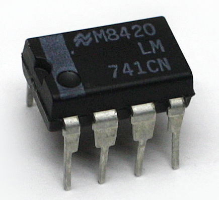
    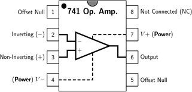
  

  <figcaption><b>The 741 is a classic op-amp.</b></figcaption>
</figure>

An op-amp is a voltage amplifier and will produce an output voltage that
is equal to the difference between the positive (non-inverting) and
negative (inverting) input voltages times a gain. The gain is fixed and
is absolutely huge (on the order of 1e6). Their output is limited by
their power supply rails (V+ and V-; also labeled VCC and VSS,
respectively). If you want the output of an op-amp to be an amplified
version of the input, rather than just bouncing back and forth between
the supply rails, you must tame them using negative feedback to reduce
the effective voltage gain. We will do that for all the circuits we use
them in.

### Breadboard
A breadboard is a convenient way of prototyping
circuits. It has the following connection diagram.

<figure align="center">
  

    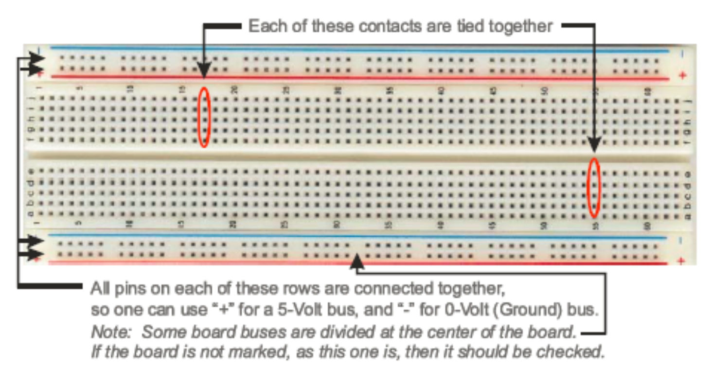
    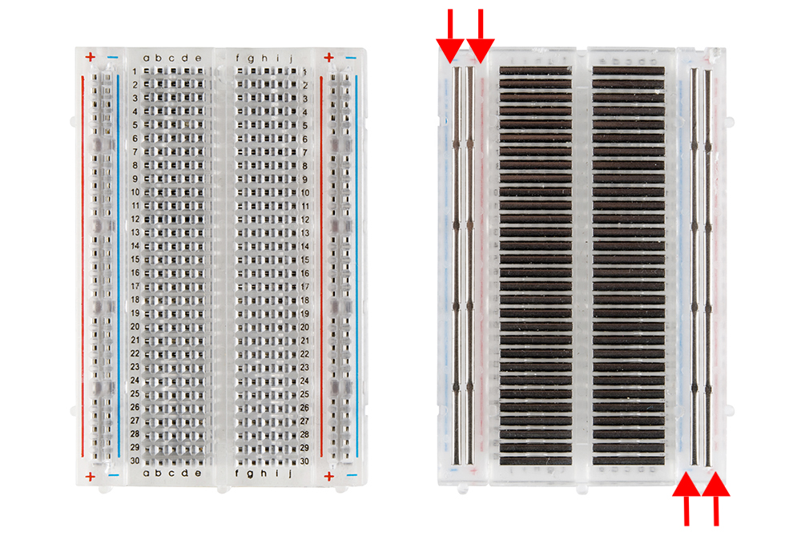
  

  <figcaption><b>A small bread board (left) with the top plastic removed (right).</b> The dark lines are metal strips that the pins of components are pressed into.</figcaption>
</figure>

### Multimeter
A multimeter is a tool for measuring static (things
that don't change quickly over time) characteristics of circuits. They
can measure resistance, capacitance, DC current, DC voltage, and the
amplitude of AC signals. They cannot measure a time series. Multimeters
are "floating" compared to earth. This means it's safe to put their
probes at any point in the circuit *when measuring voltage* because they
have no preference for what ground is. Current measurements use a
low-value shut resistor in series with the probe that can, e.g. short
power supplies.

<figure align="center">
  
  <figcaption><b>A multimeter.</b> At no point in the course should your multimeter read "600V AC". If your multimeter reads this, and you're alive, leave the area.</figcaption>
</figure>

### Oscilloscope
A piece of test equipment that allows observation of
time varying voltages. It can plot voltage as a function of time and
detect voltage events using threshold crossing (this is called
"triggering"). Some have other functions built in as well, such as the
ability to generate voltage waveforms. We will be using one of these for
this course.

NOTE: Almost all oscilloscopes, including ours, are mains earth
referenced. This means that the outer shells of the BNC connections in
the front of them are connected to earth ground (third prong on wall
plug). USB on a computer that is powered through mains-power cord is
also mains earth referenced. Therefore it's quite easy to create
unintended circuits with the ground lead on scope probes. Be careful
where you put it.

<figure align="center">
  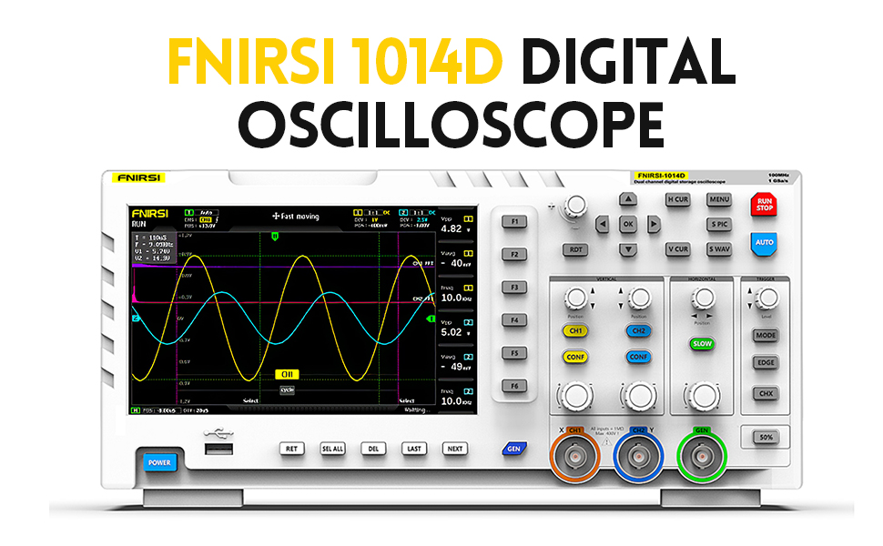
  <figcaption><b>A benchtop scope with integrated display</b></figcaption>
</figure>

<figure align="center">
  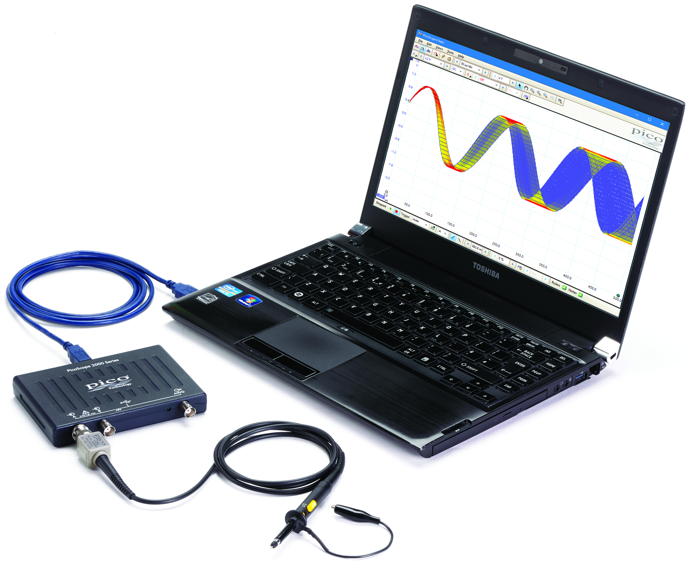
  <figcaption><b>A Pico USB scope that pairs with computer software</b></figcaption>
</figure>

### Oscilloscope Probe
A special cable that is connected to the input
of an oscilloscope and is used to probe voltages on the circuit under
test. Scope probes are designed to reduce the effect of the
oscilloscope's measurement on the circuit operation (reduce its
"loading"). They do this by attenuating the voltage before it is
measured and compensating for the parasitic capacitance of the cable
itself (how do you think they attenuate the voltage...?). The degree of
attenuation is indicated by the probe (e.g. 1x, 10x, 100x for divide by
1, 10, and 100, respectively) and must be accounted for in the scope to
get accurate voltage amplitudes. Some probes have a selectable
attenuation. We want to keep our probes in 10x.

**NOTE:** You must tell your scope software that you are using a 10x
attenuating probe so that it can multiply its captured values by 10.

<figure align="center">
  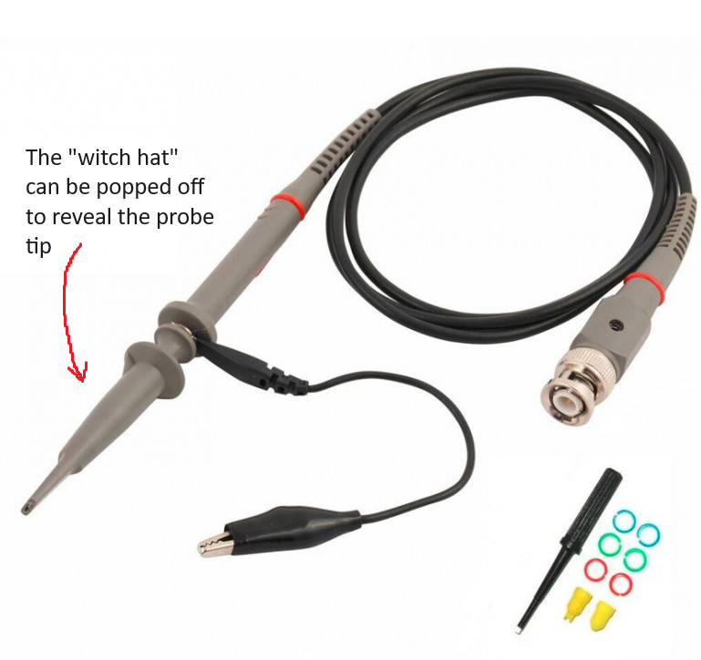
  <figcaption><b>10x Scope probe</b></figcaption>
</figure>

### Microcontroller Development Board
A microcontroller is a
single-chip computer. It has a CPU, RAM, and peripheral interfaces. They
typically don't use an operating system and therefore can run simple
programs with a high degree of regularity (there are no 'hiccups' while
the computer is 'thinking'). Therefore they are good for acquiring data
using analog-to-digital converters or generating signals using a
digital-to-analog converter. We will be using either Arduino USB,
Teensy, or Pico development boards during the course. These are all
small microcontroller boards that provide easy access to the
microcontroller's pins and allow you to load programs using USB. The
programs are written in C++ and uploaded using a device-specific tool.

<figure align="center">
  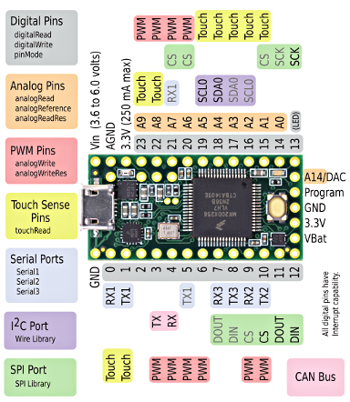
  <figcaption><b>Teensy 3.2 Pinout.</b> Potentially relevant pins for the projects: practical are A14/DAC, Vin, and GND. You will upload your programs over the USB connection and they will run on the microcontroller (black chip in the center of the board).</figcaption>
</figure>

**Power Supply:** Benchtop power supplies are designed to prove an
adjustable, low-output impedance voltage source to power electronics
under test. They can be isolated from the mains ground or non-isolated.
Bipolar (positive and negative voltage) or unipolar (only one voltage).
Supply hundreds of volts, hundreds of amps, or combinations of all of
these. They can be linear (use passive elements and a feed-back
regulated MOSFET) or switch-mode (using a DC/DC converter inside).

We have some simple, linear, isolated supplies. They have two dials. One
adjusts the voltage, the other adjusts the current limit. Keep the
current limit in the center. They are touchy. It's best to set the
voltage and test with a multimeter, before plugging it into a circuit.
We'll only really need these at the end when we record from cockroach
legs.

<figure align="center">
  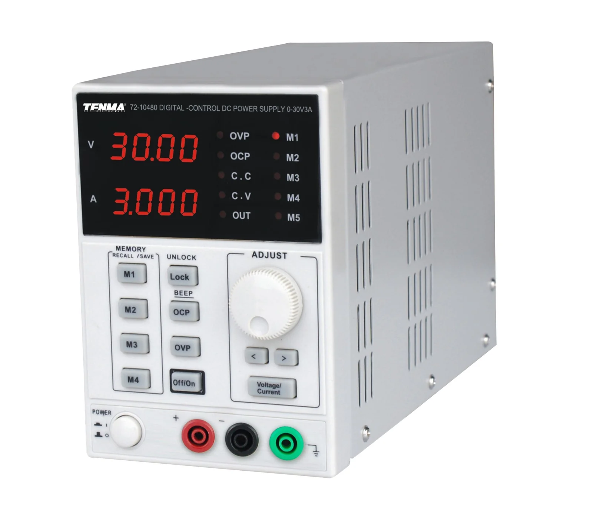
  <figcaption><b>A power supply.</b> This stock photo of one is acting strange: it's sourcing 3A at 30V (90W of power), with nothing connected between its output terminals. Where is that current going??</figcaption>
</figure>

In addition to the benchtop supplies, we have homemade switching
regulators that provide fixed output voltage (+/-15V) and are useful for
breadboarding.

<figure align="center">
  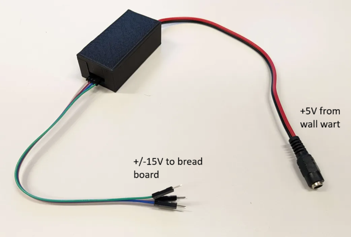
  <figcaption><b>A simple switching supply was made for the course.</b> This device has fixed +/-15V supplies and can be easily plugged into a breadboard. It's noisy: the outputs are not a pure DC voltage but have all kinds of little wiggles embedded on top of these voltages.</figcaption>
</figure>

## Hints

### Passive component values

 You don't need to use the exact values of resistors and capacitors
 presented in each circuit. If you can't find the exact resistor values
 stated in the design, then find something close. You have the
 knowledge to calculate the divide ratios, RC constants, etc. It's
 probably wise to keep things within 10-20% of the values stated here,
 but as long as you write down the component values you use, and the
 polarity of capacitors and diodes, you will be fine.

### Notes

- Take pictures of your breadboard and write notes as you go.

- The oscilloscope does not record long histories of the waveforms it
  captures. In order to capture a waveform and pause acquisition you can
  set your run mode to "single" to get a single trigger and waveform.
  You can use the "S PIC" and "S WAV" to save images and data of the
  captured waveform, respectively.

- Keeping a Google doc open to write down answers and to dump
  screenshots, phone pictures of the scope, etc into may be wise

### When in doubt, measure

- If you forget the value of a resistor that is lying around your bench,
  simply put your multimeter into resistance mode and measure it.

- If you are unsure if you have the correct power supply voltage between
  two pins on an active component, put your multimeter in voltage mode
  and measure the voltage in the position the pin will go before
  installing it

- If you are unsure that you are generating a signal, put it into your
  scope to verify

- Etc.

### Datasheets

 In the world of electronics, the datasheet is the source of ultimate
 truth. Every component you use will have a datasheet somewhere. This
 is especially important for the active components used in these
 exercises: the op-amps and instrumentation amps. If you have a doubt
 about a component, the datasheet has the answer. They are dry and can
 take expertise to understand. Your TAs will be happy to help you
 interpret their content.

[^1]: Passive means it does not require an external power source to work
[^2]: In case you forgot, passive means it does not require an external power source to work
[^3]: Active means it does require an external power source to work
